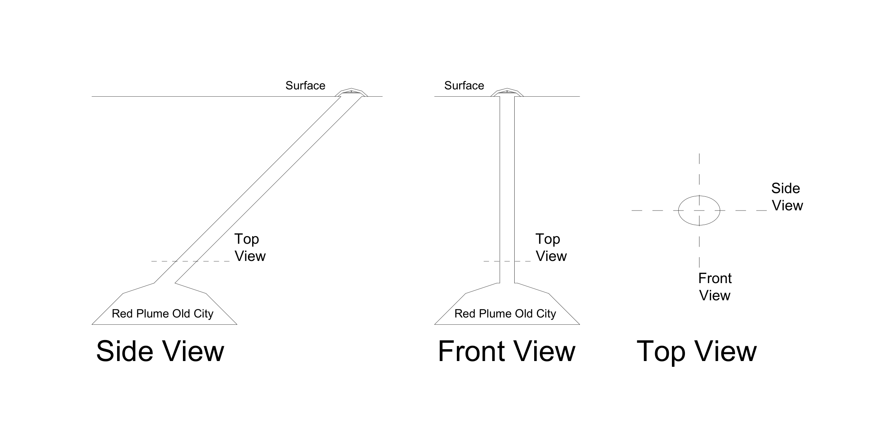
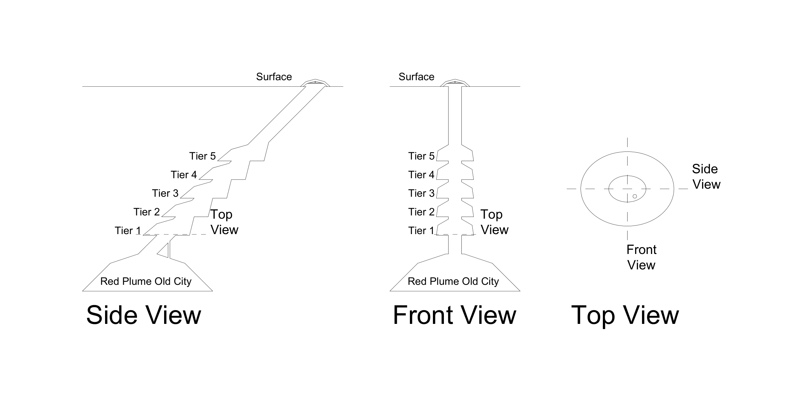
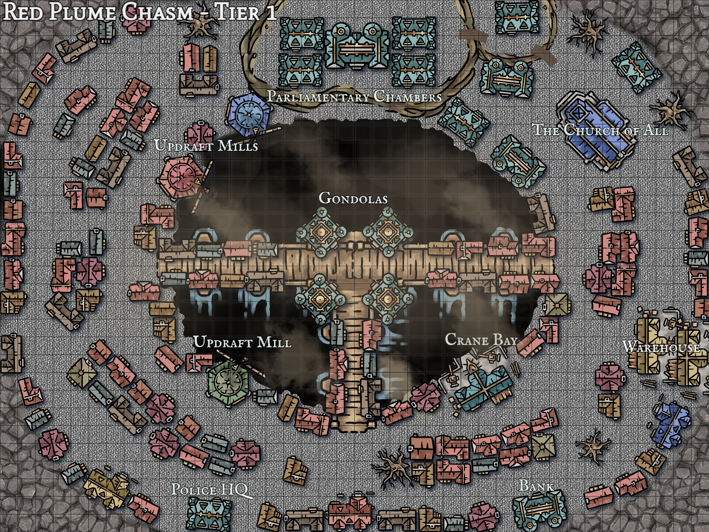

[back to Lettree Documentation Homepage](https://github.com/maryleboy/DnD/blob/main/kyle_campaign/lettree/README.md)
# Red Plume City Establishment Plan
Note: All diagrams displaying a top view are drawn such that up is north, right is east ect.
## Current Situation

After the tunnelling operation, Red Plume City (soon to be "Red Plume Old City") has been connected to the overworld by a long tunnel angled at 45 degrees stemming from Camp Mors on the surface. Due to the angle of the tunnel and the warm air from the Red Plume City causing an updraft to develop in the tunnel, the ash from the surface has not been able to reach the city. However, continually losing prima infused air to the surface is not sustainable in the long term and the open entrance presents a serious security risk to the people of Lettree.

Currently the people of Lettree are living in Red Plume City taking refuge in the abandoned old buildings. While the Sparverius are able to fly freely through the tunnel, those who have not been gifted with flight are forced to climb the 45 degree rock face. While just about functional, the massive spires of the old city could be broken down and reconstructed more efficiently into a new city. One not so reminicent of the worst days of the Sparverius...

## Proposed Development Plan
### Building Stage 1 - Constructing the Steel Dome

The most pressing matter is the leaking of the prima infused air and establishing a more robust system of defense against the surface. The "Steel Dome" proposed aims to regulate updraft outflow and scrub it of it's precious prima materia.

Spanning the entire entrace hole, this Dome will also act as a physical barrier and provide a more protective sheild behind which the defensive turrets built to fight the demons during the demon horde invasion could be mounted.

### Building Stage 2 - Excavation

Once the tunnel has been secured with the steel dome, greater habitation of the Red Plume city will become feasible. To enable expansion it is proposed that a series of rings are to be carved into the sloped rock faces creating new flat land on which new buildings can be built. This excavated spaces will form 5 tiers of flat land. Each tier will consist of a ring of flat land surrounding a central hole formed from the initial tunnel exavation. 

It is important to note that as the tunnel was dug at 45 degrees, horizontal slices of this tunnel (such as the "Top View" shown above) show an oval shape. The tiers are to be positioned along the 45 degree slant of the tunnel such that the western most edge of the central hole of a tier is directly about the eastern most edge of the tier below it.

### Building Stage 3 - Bridging the Gaps

Due to the geometry of the tiers, the western side sits on a overhanging plateau of rock whilst the eastern side sits on a secure "step". To reinforce the western side for any future construction, steel bridges are to be built across the central hole of each tier. These bridges are to be attached to the eastern rockface and act as a support to the western side.

When viewed from above, these bridges will form a "T" with a long bridge spanning from east to west and a short bridge spanning from the southern edge of the hole to the centre of the east-west bridge.

### Building Stage 4 - Building the Gondola System

4 lines of cable driven gondolas are to be built such that they pass through the gaps in the T bridges. these 4 lines will form 2 loops so that those who cannot fly can travel between the tiers of the city.

These gondolas will also travel to the current Red Plume city (soon to be "Red Plume Old City") and past Tier 5, all the way to the Steel Dome. This will allow transport to and from the surface and enable the defenses in the Steel Dome to be continuously supplied.

## Plan For the First Tier

The first tier to be developed is Tier_1 due to it's proximity to the current Red Plume city. This tier will serve as the major adminitrative district or "Capital Tier" containing government buildings, the police headquarters, the central bank ect.

In all tiers, windmills called "updraft mills" can be built to capitalise on the updraft caused by the warm air from below rising to the surface. Each tier is to contain a warehouse for storing resources. These warehouses are to be placed such that they lie directly below the edge of the hole of the tier above them. This enables crane bays to be built on the land above so that resources can be lifted from or lowered to warehouses of the tier below.

To allow Tier 1 to do this with the Red Plume Old City below it, an additional small vertical tunnel is to be dug connecting the two. This is shown in the excavation diagram.