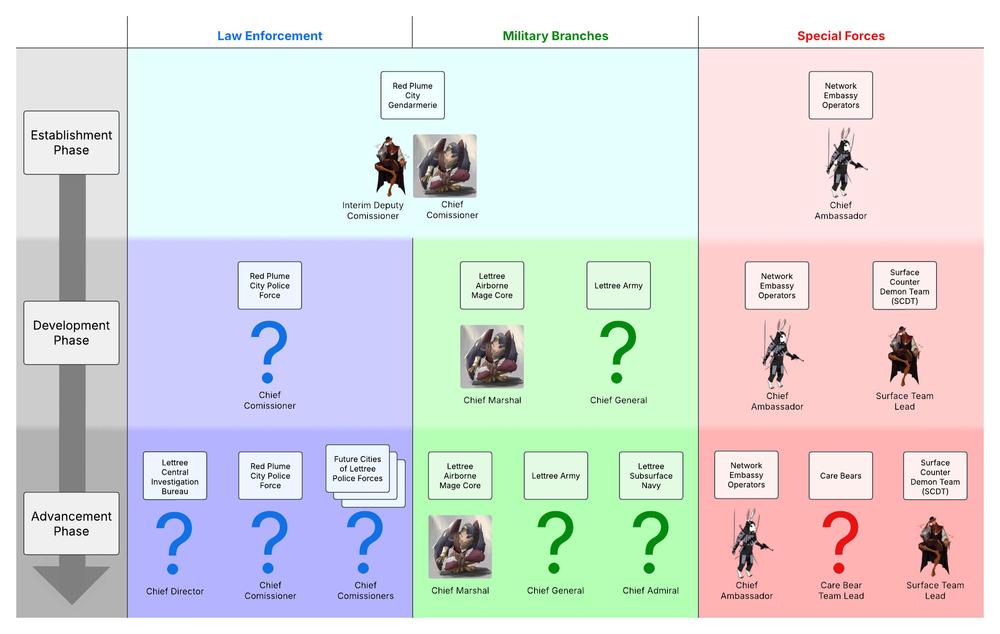
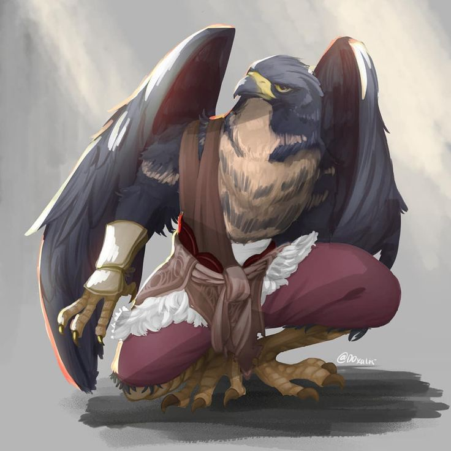
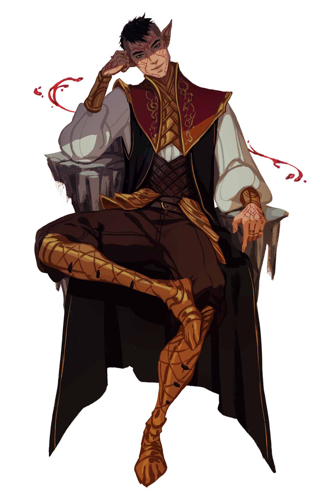
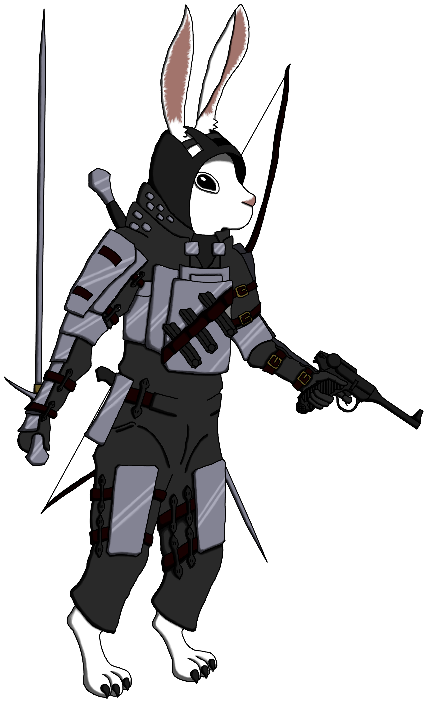
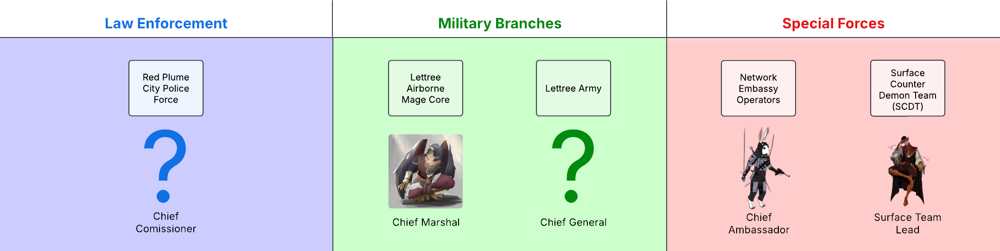
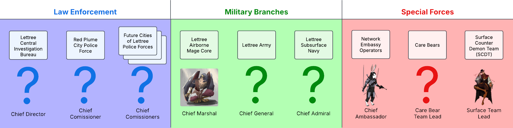

# Lettree Policing and Military Development Plan
## Multi Phase Current, Short Term and Long Term Planning

## Establishment Phase - NOW

### Overview:
In order to become an established nation, it is critical that Lettree gains the ability to field a viable force to enable defense from outside forces and enforce order from within. Lettree must also establish some capacity, however small it may need to be, to investigate and interact with the outside world in a manner enabling the understanding of and mitigation of risks.

### Goals:
- Build a force that can be established rapidly
- Ensure this force that can stretch minimal rescources and manpower
- Ensure this force compliments and utilises whatever initial strategic assets available to Lettree. Currently:
    - The Network Embassy Operators within Statue Heaven
    - Aarakockra Sparverius mages
    - The Dark Golems produced by the golem forge
    - Potentially the blood of Matthias available from the blood fountain
    - Mining equiptment (exploisives and flares)
    - Construction equiptment

### Make Up:
#### Law Enforcement and Military Branches:
##### **The Red Plume City Gendarmerie**:
- A mixed general purpose force responsible for the day to day responsibilities of law enforcement and all branches of the Lettree Military, joined to maximise minimal available manpower to create a single largest viable force of action.
- Led by **Chief Commissioner Scarlet Husband the Winged**
    - Skilled artificer.
    - Chosen for this role on account of his broad knowledge of both magecraft and it's physical aplication as well as the non linear problem solving capability required for engineering.
    - Intended to form macro scale strategic plans through use of his own knowledge as well as the ability to ingest recommendations and advise from other skilled advisors and unify many voices into a single comprehesive and cohesive strategy.

- Supported by **Interim Deputy Commissioner Silas**
    - Skilled blood hunter.
    - Chosen for this role on account of his broad knowledge of demonic and lucifix derrivative threats and extensive combat experience.
    - Intended to be able to make split second decisions to react to changes on the battlefield and dynamically steer the Gendarmerie to victory in combat.

#### Special Forces:
##### **The Network Embassy Operators**:
- A small force of covert operators working out of the Network Embassy in Red Plume City (known locally as the Easla Embassy) capable of gathering intel and performing covert actions such as assassination, sabotage and covert security.
- Led by **Chief Ambassador Lappin Laoh Lanzaroch**
    - Skilled politician and spy.
    - Chosen for this role on account of his established political status and close relationship with both **Arthur King of Lettree** and **Lesear Loatia Lanzaroch Red Hare of the Network**.
    - Intended to be capable of leading teams of operators to fulfill covert strategic goals as well as harbouring the support of **the Network**.

## Development Phase

### Overview:
In order to develop as a nation, Lettree needs to grow it's Gendarmerie to the point where it can split to form distinct and seperate institutions responisible for the enforcement of the law and the defense of Lettree. This split is esential to develop and nurture it's capacity to maintain order and de-escalate internal conflict with one hand and strike at the enemies of lettree with the other. Two fundamentally different actions that require a different touch. While combined as a single Gendarmerie, any attempt to soften the hand of the Gendarmerie against the people of lettree risks muting it capacity to engage in conflict with outside forces, and any attempt to harden the hand of the Gendarmerie against outside forces risks muting it's capacity to resolve and de-escalate conflict amongst the people at home.

The development of stronger distinct forces for order and defense will allow for a new capacity to explore a more complex military structure and establish the beginings of a set of highly trained special forces units designed to fulfill specific roles.
### Goals:
- Disband the Gendarmerie
- Build a dedicated police force responsible for maintaining law and order
- Build a dedicated military force responsible for defense of Lettree
- Establish small special forces teams to fullfill specific roles

### Make Up:
#### Law Enforcement:
##### **The Red Plume City Police Force**:
- A dedicated police force responsible for maintaining order and enforcing the law in Red Plume City. A focus on de-escalation of violence, maintaining private property rights, making arrests, conducting lawful searches, monitoring and assisting the public.
- Led by a **Chief Commissioner** yet to be determined

#### Military Branches:
##### **The Lettree Airborne Mage Core**:
- A dedicated flying branch of the Lettree Military responsible for providing air support, air to air combat and ground attack roles. A focus on ranged magic both single target and AOE. Provides a critical role in operating and exploiting a 3 dimensional combat environment in a time where most adversaries are only used to 2 dimensions. Prioritises violence of action over overwhelming force. Eyes in the sky also provide critical airborne reconissance capability and can close with and attack targets rapidly after identification, qualities that also can be used effectively for counter terror and VIP protection.
- Led by **Chief Marshal Scarlet Husband the Winged**
    - Skilled artificer and former **Chief Commissioner of the Red Plume City Gendarmerie**.
    - Chosen for this role on account of his previous experience leading military forces and specifically his knowledge on the arcane and the capabilities of Aarakockra Sparverius as well as non linear problem solving capabilities alongside his familiarity with flight.

##### **The Lettree Army**:
- A large ground based military branch responsible for large en masse ground based conflict. A focus on a projecting power through orginised large numbers of well trained soldiers. Provides a critial role in defending, capturing and holding strategic ground positions. A focus on overwhelming force over violence of action. Large numbers on the ground also provide critical logistics capability and performing manual tasks required of a military and the large stand in place defensive element of Lettree.
- Led by a **Chief General** yet to be determined

#### Special Forces:
##### **The Network Embassy Operators**:
- A development of the pre-existing establishment phase force of covert units operating out of the Network Embassy in Red Plume City (known locally as the Easla Embassy) capable of gathering intel and performing covert actions such as assassination, sabotage and covert security.
- New aims for the development of this force focus on increasing the number of operators stationed in Red Plume City and establishing a formal integration with the **Lancarran Burrow** .
- Led by **Chief Ambassador Lappin Laoh Lanzaroch**
    - Skilled politician and spy.
    - Chosen for this role on account of his established political status and close relationship with both **Arthur King of Lettree** and **Lesear Loatia Lanzaroch Red Hare of the Network**.
    - Intended to be capable of leading teams of operators to fulfill covert strategic goals as well as harbouring the support of **the Network**.

##### The Surface Counter Demon Team (SCDT):
- A small elite team of highly trained soldiers intended for limited operations on the surface of Deus. Trained in counter demon combat and surface survival skills to enable navigation, survival and meaningful action within a hostile post apocalypse surface environment.
- Led by **Surface Team Lead Silas**
    - Skilled blood hunter and former **Interim Deputy Commissioner of the Red Plume City Gendarmerie**
    - Chosen for this role on account of his broad knowledge of demonic and lucifix derrivative threats and extensive combat experience alongside his previous experience leading Lettree armed forces in combat.
    - Intended to utilise knowledge and experience to lead his team safely through the Deus surface environment and achieve strategic goals.

## Advancement Phase

### Overview
In order to advance forward as a nation Lettree needs to step beyond it's orgins as a City State become a multi settlement civilisation. Achieving this goal and establishing new cities beyond Red Plume City will be diffucult but once achieved the scale of defending and enforcing the law in multiple locations seperated by considerable distances will represent it's own challeges. 

In regards to law enforcement, it is essential that lettree is capable of forming new Police Force institutions for each settlement it founds in order to enforce the law and maintain order in each settlement. In order to invistage crimes that cross city borders or crimes of great interest to nation of lettree itself and innapropriate to investigate at city level, Lettree must establish some form of national level investigative capability to fill the gaps between each city's respective police force.

In regards to defense, it is essential that Lettree is able to scale its armed forces in a way that provides the manpower to engage in combat on multiple fronts while maintaining agility and cohesion. The substantial jump from city state to multi settlement nation will also likely increase Lettree's capability to engage in larger scale politics on the international stage, such actions requires a more substantial combatative force capable of waging large scale operations far from home.

### Goals
- Build dedicated police forces for each city founded as part of Lettree
- Build some capability to investigate crimes at a national level to assist the city level police forces
- Drastically increase the scale of the Lettree Armed Forces
- Gain the capacity to engage in conflict far from home in order to fulfil strategic international political goals
- Complement the policing and military institutions with a more developed and robust set of special forces units.
